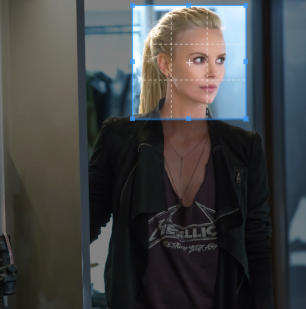
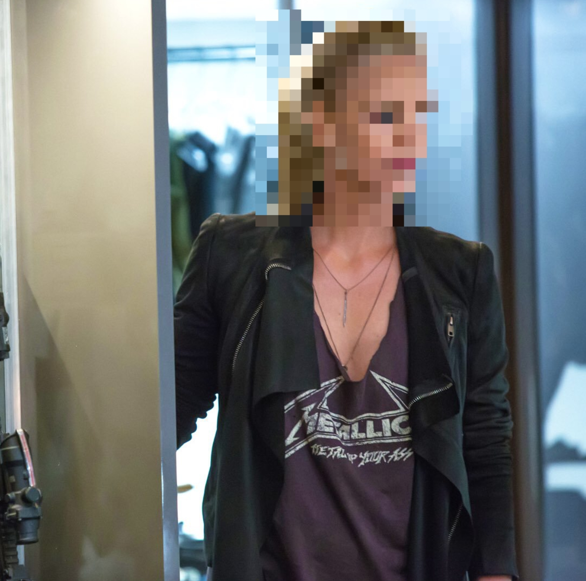

### Additional Filters for Liip Imagine Bundle
> pixelate filter
> blur filter


#### Basic usage

```yml
liip_imagine:
    filter_sets:
        pixelate:
            data_loader: stream.your_data_loader
            quality: 90
            filters:
                pixelate_filter:
                   size: [100, 200] //width and height
                   start: [500, 230] //starting points x and y
                   intensity: 16 // you can omit this, default is 16
                   type: ellipse // default is rectangle
         blur:
            data_loader: stream.your_data_loader
            quality: 90
            filters:
               blur_filter:
                  size: [100, 200] //width and height
                  start: [500, 230] //starting points x and y
                  
```

Before



after

